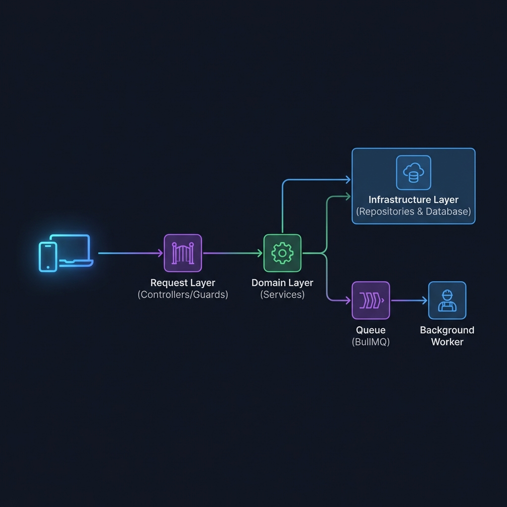

# Express.js Application in Nest-Style Architecture (Monorepo)

##### A robust, scalable, and enterprise-ready Node.js platform built with a Nest-style architecture. This project features a custom Dependency Injection (DI) system, modular design, and a powerful computation offloading engine using BullMQ. Re-architected into a Monorepo for maximum extensibility and microservices readiness.

---

# 📖 Table of Contents

1. [Features](#-features)
2. [Architecture Overview](#-architecture-overview)
3. [Interaction Flow in DDD and Architecture](#-interaction-flow-in-ddd-and-architecture)
4. [Key Technical Features](#-key-technical-features)
5. [Design Patterns](#-design-patterns)
6. [Principles](#-principles)
7. [Technologies](#-technologies)
8. [Getting Started](#-getting-started)
9. [Project Structure](#-project-structure)
10. [API Documentation (REST)](#-api-documentation-rest)
11. [API Documentation (GraphQL)](#-api-documentation-graphql)
12. [Running the Application](#-running-the-application)
13. [Usage](#-usage)
14. [Health Monitoring](#-health-monitoring)
15. [Local-to-Cloud Migration](#-local-to-cloud-migration)
16. [Testing & Validation](#-testing--validation)
17. [Enterprise Orchestration (Kubernetes)](#-enterprise-orchestration-kubernetes)
18. [Observability (Prometheus)](#-observability-prometheus)
19. [Contributing](#-contributing)
20. [License](#-license)

---

# ✨ Features

## User Management & Auth

- **Complete User CRUD Lifecycle**: Integration with PostgreSQL.
- **Security**: JWT-based auth, RBAC, and strict validation logic.
- **Business Rules**: Self-deletion prevention and sensitive field lock-down.

## Computation Offloading (@Compute)

- **Transparent Task Delegation**
  - Simply annotate any service method with `@Compute()` to offload it to background workers.
  - Handles both "Wait-for-result" and "Fire-and-forget" (background) modes.
- **Intelligent Worker Spawning**
  - The API process automatically spawns and manages a pool of child worker processes.

## System Resilience

- **Lazy Initialization Pattern**: Strictly ordered startup sequence (DB -> Redis -> App).
- **Universal Graceful Shutdown**: Centralized lifecycle management.
- **Circuit Breaker Pattern**: Automatic failure detection and isolation.

---

# 🏗 Architecture Overview

We have transitioned to a **Monorepo** structure to ensure independent scalability and microservices readiness.

### Core Components

- **Shared Kernel (`packages/backend/common`)**: Single source of truth for guards, decorators, and utils.
- **Backend (`packages/backend/core-api`)**: The main API gateway and worker manager.
- **Frontend (`packages/frontend/admin`)**: The administrative UI.
- **Infrastructure (`packages/infrastructure`)**: Centralized DevOps configuration.


---

# 🧩 Interaction Flow in DDD and Architecture

This project strictly adheres to Domain-Driven Design (DDD) principles, ensuring that each layer has a clear responsibility and that dependencies flow inwards.



## 1. Request Layer

- Incoming requests flow through global middleware (Logging, Rate Limiting) into specialized **Controllers**.
- Handlers use decorators like `@Get`, `@Post`, and `@Param` for clear route definitions.

## 2. Business Logic (Services)

- Services contain the core domain logic.
- Methods requiring heavy processing are transparently offloaded to background workers using the `@Compute` proxy.

## 3. Infrastructure Layer

- **DatabaseService**: Manages PostgreSQL connections.
- **Redis/BullMQ**: Handles the transport layer for offloaded jobs.
- **LifecycleModule**: Coordinates system-wide startup and shutdown.

---

# ⚙️ Key Technical Features

- **Custom Decorators**: Support for `@Injectable`, `@Module`, `@Inject`, and `@Compute`.
- **Centralized Logging**: Structured, console-based logging with diagnostic prefixes.
- **Strict Role detection**: Automatic role assignment for parent and child processes.
- **Rate Limiting (Throttling)**: Intelligent request limiting based on IP and User ID.
- **Error Handling**: Standardized Exception Filters.

---

# 🧩⚙️🛠️📐 Design Patterns

## 1. Singleton Pattern

- Ensures a single instance of the DI Container, Database services, and Logger.

## 2. Dependency Injection (DI)

- Decouples components by injecting dependencies at runtime (Moved to `@config/libs`).

## 3. Proxy Pattern

- Used by the `ComputeExplorer` to intercept method calls and redirect them to the BullMQ queue.

## 4. Repository Pattern

- Abstracts database queries behind a clean interface, separating domain logic from persistence.

## 5. Decorator Pattern

- Extensively used for metadata tagging (`@Module`, `@Injectable`) and runtime behavior modification.

## 6. Factory Pattern

- Implemented in module providers to handle complex instance creation.

## 7. Caching Decorator Pattern

- Simple `@Cache()` annotation for transparent Redis persistence.

## 8. Strategy Pattern (Storage)

- Universal storage interface for S3, MinIO, and local filesystem.

## 9. Circuit Breaker Pattern

- Prevents cascading failures by isolating failing external services.

## 10. Migration Strategy Pattern

- Decouples schema evolution from code deployments using versioned migration files.

---

# 📏🧭💡⚖️ Principles

- **SOLID**: Strict adherence to all five principles.
- **DRY (Don't Repeat Yourself)**: Shared utilities in `packages/backend/common`.
- **KISS (Keep It Simple, Stupid)**: Maintaining the lean nature of Express while gaining Nest architecture benefits.

---

# 💻 Technologies

- **Monorepo**: NPM Workspaces
- **Runtime**: Node.js (v20+)
- **Language**: TypeScript
- **Queue**: BullMQ / Redis
- **Database**: PostgreSQL
- **Frontend**: Angular 18+ (Standalone)

---

# 🚀 Getting Started

## 1. Prerequisites

- Node.js (v20.x or higher)
- Docker & Docker Compose

## 2. Installation

```bash
# Install all dependencies for all workspaces
npm install
```

## 3. Infrastructure Setup (Docker)

This project uses Docker to manage infrastructure services (Redis and PostgreSQL).

```bash
# Start the infrastructure (PostgreSQL & Redis)
cd packages/infrastructure/deployment/dev
bash start.sh
```

## 4. Environment Setup

```bash
# Copy example env to root
cp .env.example .env
```

---

# 📂 Project Structure

```bash
/
├── packages/               # Monorepo Workspaces
│   ├── backend/
│   │   ├── core-api        # Main API & Worker Application
│   │   │   ├── src/modules/*/graphql  # Feature-specific GraphQL types
│   │   │   └── src/main.ts            # App Bootstrap & Lifecycle registration
│   │   └── common          # Shared Library (@config/libs)
│   │       ├── src/application        # Lifecycle & Graceful Shutdown
│   │       ├── src/core               # DI Container, GraphQL Engine, Guards
│   │       ├── src/infrastructure     # Config, DB, Redis, Cache, Compute, Storage
│   │       └── src/domain             # Enums, Interfaces, Types, Exceptions
│   ├── frontend/admin      # Angular 18+ Admin Dashboard
│   └── infrastructure      # DevOps & Infrastructure
│       ├── deployment/dev  # Local dev environment (PostgreSQL, Redis)
│       ├── infra           # K8s manifests (ArgoCD, Prometheus, Zero-trust)
│       └── scripts         # Maintenance & Stress-test scripts
├── image/                  # Project assets and architectural diagrams
├── node_modules/           # Monorepo-level dependencies (shared across packages)
├── .gitignore              # Standard Git exclusion matching monorepo patterns
├── .prettierrc             # Unified code formatting rules
├── eslint.config.mjs       # Project-wide linting configuration
├── LICENSE                 # MIT License details
├── package-lock.json       # Deterministic dependency tree for the entire workspace
├── package.json            # Monorepo root (links all packages via Workspaces)
├── README.md               # You are here!
└── tsconfig.json           # Global TypeScript configuration and path aliases
```

### 🏛️ Why This Structure?

This project follows a **Modular Monorepo Architecture** for several critical reasons:

1.  **Strict Separation of Concerns**: By isolating the `common` library (Shared Kernel), we ensure that core logic (like DI, Security, and Database adapters) is reusable and never coupled to a specific delivery mechanism (REST or GraphQL).
2.  **Shared Infrastructure**: Root-level configuration files (`tsconfig.json`, `eslint.config.mjs`) ensure consistent standards across all backend and frontend packages, reducing maintenance overhead.
3.  **Scalability**: The separation of `core-api` from `infrastructure` allows you to scale background workers independently of the API gateway while keeping the deployment logic (Kubernetes) centralized.
4.  **Developer Experience**: NPM Workspaces allow for local linking, so changes in `packages/backend/common` are immediately reflected in `packages/backend/core-api` without needing to publish packages.
5.  **Single Source of Truth**: Assets, documentation, and shared dependencies live at the root, ensuring that the entire ecosystem (API, Workers, Admin UI) moves in sync.

---

# 📚 API Documentation (REST)

This project uses **Swagger (OpenAPI)** for interactive documentation.

## Swagger UI

Access at: `http://localhost:3000/api` (Dev Mode only)

## Authentication

1.  **JWT**: Click "Authorize" and enter your Bearer token.
2.  **API Key**: Enter `HEALTH_CHECK_SECRET` for infrastructure endpoints.

---

# 🔮 API Documentation (GraphQL)

The project includes a custom, Nest-style GraphQL engine built on top of Express.

## Endpoints

- **GraphQL API**: `http://localhost:3000/graphql` (POST)
- **GraphiQL Playground**: `http://localhost:3000/graphiql` (GET - Dev Mode only)

## Authentication in GraphQL

To access protected resolvers (like `UsersResolver`), you must include a Bearer token in the `Authorization` header:

```json
{
  "Authorization": "Bearer YOUR_JWT_TOKEN"
}
```

## Example: Users Query (RBAC Enforced)

```graphql
query GetUsers {
  users(page: 1, limit: 10) {
    data {
      id
      email
      firstName
      lastName
      role
      isActive
    }
    pagination {
      total
      totalPages
      page
    }
  }
}
```

## Example: Create User Mutation

```graphql
mutation CreateUser {
  createUser(email: "newuser@example.com", password: "StrongPassword123", firstName: "John", lastName: "Doe") {
    id
    email
    role
  }
}
```

## Example: Delete User Mutation

```graphql
mutation DeleteUser {
  deleteUser(id: "123") {
    success
    message
  }
}
```

---

# 🚀 Running the Application

### Development Mode

```bash
# Run Backend and Frontend in parallel (or separate tabs)
npm run dev:backend
npm run dev:frontend
```

### Production Mode

```bash
# Build all packages
npm run build

# Start Backend
npm run start -w @app/core-api
```

---

# 🛠 Usage

### Example: Computation Offloading

Simply add the decorator to any async method:

```typescript
@Compute({ priority: 1, attempts: 2 })
async heavyTask(data: unknown) {
  // Automatically runs in a background worker process!
  await performIntensiveCalculation(data);
}
```

### Example: Global Caching

```typescript
@Cache({ ttl: 3600 })
async getExpensiveData() {
  return await this.repo.findVeryHeavyData();
}
```

### Example: Storage Abstraction

```typescript
constructor(private readonly storageService: StorageService) {}

async uploadAvatar(file: Buffer) {
  await this.storageService.upload('avatars/user-1.png', file);
}
```

---

# 🏥 Health Monitoring

The application includes a built-in health check system.

### Endpoints

- **Liveness (`/health/live`)**: Process responsiveness.
- **Readiness (`/health/ready`)**: DB/Redis connectivity.

### Monitored Components:

- **PostgreSQL**: Connection status.
- **Redis**: PING check.
- **BullMQ**: Queue depth and worker status.

---

# ☁️ Local-to-Cloud Migration

This project is bridge-ready for cloud deployment.

### 1. Database (RDS)

- Point env vars (`DB_HOST`, etc.) to your managed instance.

### 2. Caching (ElastiCache)

- Update `REDIS_HOST` and `REDIS_PASSWORD`.

### 3. Computation Assets

- **API Mode**: `COMPUTE_APP_ROLE=api`
- **Worker Mode**: `COMPUTE_APP_ROLE=worker` (Scale independently)

### 4. Storage (S3)

- Set `STORAGE_STRATEGY=s3` and provide credentials.

---

# 🛡 Testing & Validation

We include specialized scripts in `packages/infrastructure/scripts`.

### 🛡️ Rate Limiting Test

```bash
node packages/infrastructure/scripts/test-throttling.js
```

### ⚡ Stress Test

Verify parallel processing:

```bash
node packages/infrastructure/scripts/stress-test.js
```

---

# ☸️ Enterprise Orchestration (Kubernetes)

We provide a professional K8s suite in `packages/infrastructure/infra`.

### Automated Deployment

```bash
# Deploy entire stack
./packages/infrastructure/scripts/deploy.sh
```

### Key Components

- **API Pods**: HPA-enabled.
- **Worker Pods**: Headless background processors.
- **NetworkPolicies**: Zero-trust internal traffic.

---

# 📊 Observability (Prometheus)

Prometheus metrics are exposed at:

```bash
curl http://localhost:3000/metrics
```

**Metrics Collected**:

- HTTP Latency & Status Codes
- Node.js Event Loop Lag
- Memory & CPU Usage

---

# 🤝 Contributing

1.  Fork the project.
2.  Create a feature branch.
3.  Commit your changes.
4.  Push and open a PR.

---

# 📝 License

Distributed under the MIT License.
See `LICENSE` for more information.
